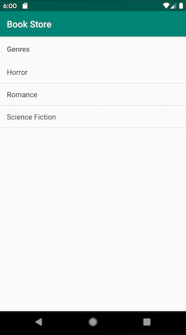
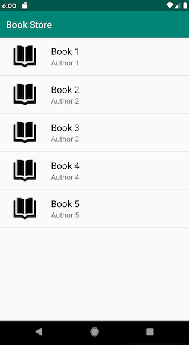
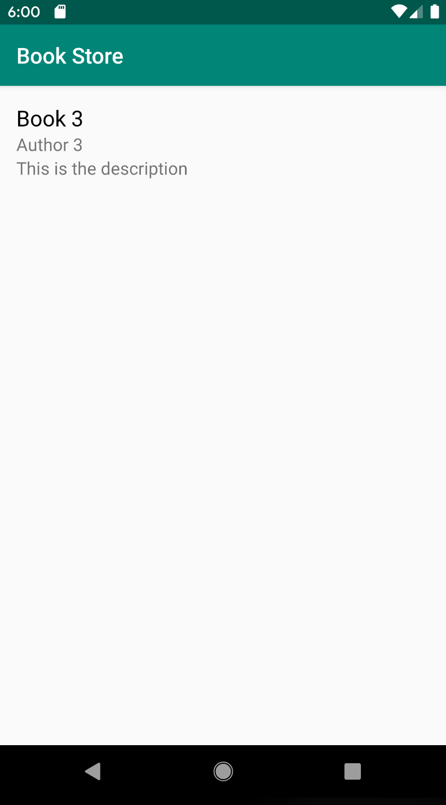

Introduction
=====================

In the first part of this tutorial we made an app that allows a user to enter their name into an input field. When clicking the submit button, a new screen opens that shows a message with their name. In the second part of this tutorial, you will build a bookstore app. The main page to the app will display a list of book categories. Clicking on a category will open a screen that shows a list of books. Clicking on a book will open a screen that shows details about the book. You will learn how to create lists using a string array, ArrayAdaptor, custom ArrayAdaptor and create a detail view from the list of items. These are the steps we will follow:

- Create a list of categories
- Create a list of books
- Refactor list of books
- Create detail view of books


Creating a list of categories
======================

We will use a string array to show our list of categories. We are making this decision because we have a small list of items that won’t change. Here is the list of steps we will take:

1. Create the string array in the string resources
2. Create the layout for the category activity
3. Add click listeners to each item in the list

First, in strings.xml add a string array named `genres` that has items for each genre.

```xml
<string-array name="genres">
   <item>Horror</item>
   <item>Romance</item>
   <item>Science Fiction</item>
</string-array>
```

Second, open the activity_main layout. Erase the contents and add a vertical LinearLayout for the root view. Add  a textview inside the LinearLayout to display the title of the page and a ListView to display each genre. A ListView displays a vertically-scrollable collection of views. The ListView has an attribute named `entries` that we will set to the name of the string array we created. Here is our layout file:


```xml
<?xml version="1.0" encoding="utf-8"?>
<LinearLayout xmlns:android="http://schemas.android.com/apk/res/android"
   android:layout_width="match_parent"
   android:layout_height="match_parent"
   android:orientation="vertical">
   <TextView
       android:layout_width="match_parent"
       android:layout_height="wrap_content"
       android:padding="16dp"
       android:text="Genres"
       android:textSize="16sp"
       android:textStyle="bold"/>
   <ListView
       android:id="@+id/list_options"
       android:layout_width="match_parent"
       android:layout_height="match_parent"
       android:entries="@array/genres" />
</LinearLayout>
```



Third, we add click listeners to each category view. First we get a reference to the ListView we created. 

```java
ListView listView = findViewById(R.id.list_options);
```

Then we call the [setOnItemClickListener(https://developer.android.com/reference/android/widget/AdapterView.OnItemClickListener) on the ListView. 

```java
listView.setOnItemClickListener(new AdapterView.OnItemClickListener() {
   @Override
   public void onItemClick(AdapterView<?> adapterView, View view, int position, long id) {
       if (position == 0) {
           Intent intent = new Intent(MainActivity.this, HorrorCategoryActivity.class);
           startActivity(intent);
       };

   }
});
```

Inside the `onItemClick` method, we create a new intent to launch the HorrorCategoryActivity if the first item in the list is clicked. As an exercise, implement the code to launch activities for the remaining genres.

Using an ArrayAdapter to create a list of books
========================================

If we have a variable amount of items that may be a long list, we can initialize them in an array. Because we are using an array, we will need to use an [ArrayAdapter](https://developer.android.com/reference/android/widget/ArrayAdapter.html)
 to display our books. An ArrayAdapter is a special kind of adapter. An [adapter](https://developer.android.com/reference/android/widget/Adapter.html)
 binds our data to the view (a ListView in our case). An array adapter binds data from a collection to a view.  A TextView is created by default for each item in the collection. The text for the TextView is set by calling the `toString` method on the item in the collection. The following are the steps we will take to create a list of books for the Horror category:

1. Create the activity
2. Create the layout
3. Load the books 
4. Set the ListView adapter

First, we will create the HorrorCategoryActivity which will show a list of books for the horror genre. We change `activity_horror_category.xml`  to `list.xml` because we will use the same layout for each category’s activity. Replace the contents with a ListView.

```xml
<?xml version="1.0" encoding="utf-8"?>
<ListView xmlns:android="http://schemas.android.com/apk/res/android"
    android:id="@+id/list"
    android:layout_width="match_parent"
    android:layout_height="match_parent" />
```

Inside `HorrorCategoryActivity.java` set the view to the list layout.

```java
protected void onCreate(Bundle savedInstanceState) {
   super.onCreate(savedInstanceState);
   setContentView(R.layout.list);
}
```

To load our books into the ListView, we will create an array of books. In future tutorials, you will learn how to load items from a database and from an HTTP request. Add this is the array to the `onCreate` method: 

```java
String[] books = {"Book 1", "Book 2", "Book 3", "Book 4", "Book 5"};
```

Next, initialize an array adapter with a context, view, and array of books. The resource view we use is a built in view from android. In the next section we will see how to create our own view for list items.

```java
ArrayAdapter<String> adapter = new  ArrayAdapter<String>(this, android.R.layout.simple_list_item1, books);
```

Finally, get a reference to the ListView and set the adapter. 

```java
ListView listView = findViewById(R.id.list);
listView.setAdapter(adapter);
```


Using a custom array adapter to create a list of books
================================================

The previous example only allows us to create a list of items containing a single string. But what if we wanted to show more than just the book title? We will need to create a custom ArrayAdapter to change the default view. We will update our books list view to show the title, author, and cover image of the book. We will also set a click listener for each book that will start a new activity showing us a summary of each book. These are the steps we will take:

1. Create book model with a title, author, image and description
2. Update the array of books in the HorrorCategoryActivity to use book objects
3. Create the custom list_item layout to show the book detail
4. Create the custom ArrayAdapter for books 
5. Set the adapter for the ListView to use the book adapter in the activity

Step one, create the book model with a title, author, image and description. Create a file by right clicking on the package name and choosing `new-->Java Class`. Give the class the name Book. This is the model:

```java
package com.example.android.bookstore;

public class Book {
   private String mTitle;
   private String mAuthor;
   private int mImageResourceId;
   private String mDescription;

   public Book(String title, String author, int imageResourceId, String description) {
       mTitle = title;
       mAuthor = author;
       mImageResourceId = imageResourceId;
       mDescription = description;
   }

   public String getTitle() {
       return mTitle;
   }

   public void setTitle(String title) {
       mTitle = title;
   }

   public String getAuthor() {
       return mAuthor;
   }

   public int getImageResourceId() {
       return mImageResourceId;
   }

   public void setImageResourceId(int imageResourceId) {
       mImageResourceId = imageResourceId;
   }

   public String getDescription() {
       return mDescription;
   }

   public void setDescription(String description) {
       mDescription = description;
   }
}
```

Step two, we will update the books array in the `onCreate` method of the HorrorCategoryActivity to use book objects. For now, we will pass dummy data into the constructor. A default image has been added to the `res/drawable` folder and named book_cover.png. Here is the new ArrayList:

```java
ArrayList<Book> books = new ArrayList<>();
books.add(new Book("Book 1", "Author 1", R.drawable.book_cover, "This is the description"));
books.add(new Book("Book 2", "Author 2", R.drawable.book_cover, "This is the description"));
books.add(new Book("Book 3", "Author 3", R.drawable.book_cover, "This is the description"));
books.add(new Book("Book 4", "Author 4", R.drawable.book_cover, "This is the description"));
books.add(new Book("Book 5", "Author 5", R.drawable.book_cover, "This is the description"));
```

Step three, we will create the custom list_item layout. This will determine how each book will appear in the list. 

```xml
<?xml version="1.0" encoding="utf-8"?>
<LinearLayout xmlns:android="http://schemas.android.com/apk/res/android"
   android:layout_width="match_parent"
   android:layout_height="80dp"
   android:padding="16dp"
   android:orientation="horizontal">
   <ImageView
       android:layout_width="80dp"
       android:layout_height="match_parent"
       android:src="@drawable/book_cover"
       android:id="@+id/list_item_icon" />
   <LinearLayout
       android:layout_width="match_parent"
       android:layout_height="match_parent"
       android:orientation="vertical"
       android:paddingLeft="16dp"
       android:id="@+id/text_container" >
       <TextView
           android:layout_width="wrap_content"
           android:layout_height="wrap_content"
           android:textSize="20sp"
           android:textColor="#000000"
           android:id="@+id/book_title"/>
       <TextView
           android:layout_width="wrap_content"
           android:layout_height="wrap_content"
           android:textSize="16sp"
           android:id="@+id/book_author" />
   </LinearLayout>
</LinearLayout>
```

On to part 4 where we will create the custom ArrayAdapter for our books.  Create a new Java Class named BookAdapter. Have the class extend ArrayAdapter. 

```java
package com.example.android.bookstore;

import android.widget.ArrayAdapter;

public class BookAdapter extends ArrayAdapter<Book> {
  ...
}
```

Inside the class create a constructor that takes a context and list as parameters. 

```java
public BookAdapter(Activity context, ArrayList<Book> list) {
   super(context, 0, list);
}
```

Next override the `getView` method. This method displays the data at the specified position in the list. This will create a view based on our list_item layout and set the text for the book’s title, and author, and set the image for the book’s cover.

```java
@Override
public View getView(int position, View convertView, ViewGroup parent) {
   View listItemView = convertView;
   if(listItemView == null) {
       listItemView = LayoutInflater.from(getContext()).inflate(R.layout.list_item, parent, false);
   }

   Book book = getItem(position);

   TextView titleTextView = listItemView.findViewById(R.id.book_title);
   titleTextView.setText(book.getTitle());

   TextView authorTextView = listItemView.findViewById(R.id.book_author);
   authorTextView.setText(book.getAuthor());

   ImageView iconImageView = listItemView.findViewById(R.id.list_item_icon);
   iconImageView.setImageResource(book.getImageResourceId());
  
   return listItemView;
}
```

 In step five set the BookAdapter. In the `onCreate` method of the HorrorCategoryActivity delete the call to create an array adapter and instantiate a BookAdapter instead. Pass the context and the list of books to the constructor. 

```java
BookAdapter adapter = new BookAdapter(this, books);
```

Last, get a reference to the list view and set the adapter.

```java
ListView listView = findViewById(R.id.list);
listView.setAdapter(adapter);
```



As an exercise, repeat the above steps for the other category activities.


Creating a detail view for each book
=====================================

Last, we will create the book detail view. When we click on a book from the book list, it will open a new screen that displays the book’s title, author and description. These are the steps we will take:

1. Edit book detail layout
2. Set click listener on book list
3. Edit book detail activity 

First, right click on the package name and choose `new-->activity-->empty activity`. Name the activity BookDetailActivity. This will create the activity and generate a layout file. Open activity_book_detail.xml. Delete the contents. We will add a LinearLayout as the root view. Inside, add three TextViews for the book title, author, and description.

```xml
<?xml version="1.0" encoding="utf-8"?>
<LinearLayout
   xmlns:android="http://schemas.android.com/apk/res/android"
   android:layout_width="match_parent"
   android:layout_height="match_parent"
   android:orientation="vertical"
   android:padding="16dp">
   <TextView
       android:layout_width="match_parent"
       android:layout_height="wrap_content"
       android:textSize="20sp"
       android:textColor="#000000"
       android:id="@+id/book_title_detail"/>
   <TextView
       android:layout_width="match_parent"
       android:layout_height="wrap_content"
       android:textSize="16sp"
       android:id="@+id/book_author_detail"/>
   <TextView
       android:layout_width="match_parent"
       android:layout_height="wrap_content"
       android:textSize="16sp"
       android:id="@+id/book_description_detail"/>
</LinearLayout>
```

Second, inside the HorrorCategoryActivity attach a click listener to the ListView using `setOnItemClickListener`. 

```java
listView.setOnItemClickListener(new AdapterView.OnItemClickListener() {
   @Override
   public void onItemClick(AdapterView<?> adapterView, View view, int position, long id) {
     ...
  }
});
```

Inside the `onItemClick` method create a new intent to launch the BookDetailActivity. 

```java
 Intent intent = new Intent(HorrorCategoryActivity.this, BookDetailActivity.class);
```

Next, get a reference to the book from our books ArrayList at position `position` and pass it along to the next activity. The books Arraylist will have to be declared final. And we will have to make the Book class implement Serializable. This allows us to pass objects in the intent extra. We are adding intent extras this way because it is simpler than adding individual attributes.

```java
 Book book = books.get(position);
 intent.putExtra("Book", book);
```

Last, we start the activity.

```java
startActivity(intent);
```

The third step is to edit the BookDetailActivity. In the `onCreate` method get the intent extra to access the book object we sent. Then set the view for the each TextView we defined in the activity_book_detail layout. 

```java
Book book = (Book)getIntent().getSerializableExtra("Book");

TextView titleTextView = findViewById(R.id.book_title_detail);
titleTextView.setText(book.getTitle());

TextView authorTextView = findViewById(R.id.book_author_detail);
authorTextView.setText(book.getAuthor());

TextView descriptionTextView = findViewById(R.id.book_description_detail);
descriptionTextView.setText(book.getDescription());
```



Summary
============================

First we used a string array to create a list of categories for the books. We defined the string array in the strings resource file and bound it to the ListView using the `entries` attribute. Next, we added an `onItemClickListener` to one of the categories to show a list of books when the category is clicked. This list was generated using an array of books and an ArrayAdapter. The ArrayAdapter acts as the bridge between the data and the view. Then we redesigned the book list to show a cover image, title and author. This was achieved using a custom array adapter. Last we added an `onClickItemListener` to the list of books to show a detail view of the selected book. 


Resources
============================

- [Udacity Android Basics: Multiscreen Apps]https://www.udacity.com/course/android-basics-multiscreen-apps--ud839
- [Head First Android Development, 2nd Edition](https://learning.oreilly.com/library/view/head-first-android/9781491974049/)
- [Android AdapterView.OnItemClickListener Documentation](https://developer.android.com/reference/android/widget/AdapterView.OnItemClickListener)
- [Android Adapter Documentation](https://developer.android.com/reference/android/widget/Adapter.html)
- [Android ArrayAdapter Documentation](https://developer.android.com/reference/android/widget/ArrayAdapter.html)
